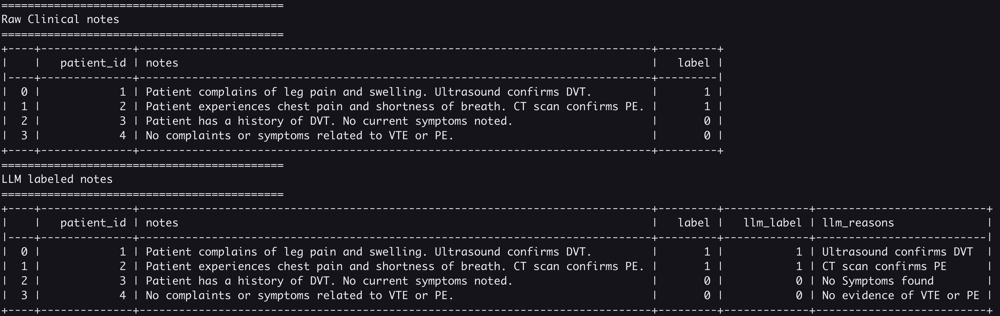

<p align="center">

</p>

## Getting Started (Contributors)

1. Clone the llmtag repo
2. Download weights - any llama2 compatible model should work
    - Get llama 7B chat weights[https://huggingface.co/TheBloke/Llama-2-7b-Chat-GGUF/resolve/main/llama-2-7b-chat.Q4_K_M.gguf]
    - Save it under ./models/7B
3. Add the model path to the environment variable `MODEL`
    - create .env file in root directory of repository (e.g. touch .env)
    - copy and paste below or define your own path to the model binary (actual model weights)
    -  `.env`
        ```
        MODEL=./models/7B/llama-2-7b-chat.Q4_K_M.gguf
        ```
4. Initialize the environment with `poetry install` (if new to poetry, please check [this](https://python-poetry.org/))
5. For leveraging  GPUs, please check - [llama-cpp-python](https://github.com/abetlen/llama-cpp-python)
   - Follow the instructions for installation as per your machine specifications
   - For simple CPU use case, can resort to not using GPU, but will be very time intensive, orders of magnitude more
   - Ignore this step for now unless you know better

### Post installation
1. Run all tests using `poetry run python -m pytest tests/`
2. Run the default example: `poetry run python -m llmtag`

### Results



## Libraries Used

1. [llama.cpp](https://github.com/ggerganov/llama.cpp/tree/master)
2. [llama-cpp-python](https://github.com/abetlen/llama-cpp-python)
3. [Model Weights](https://huggingface.co/TheBloke)
4. [poetry](https://python-poetry.org/)
